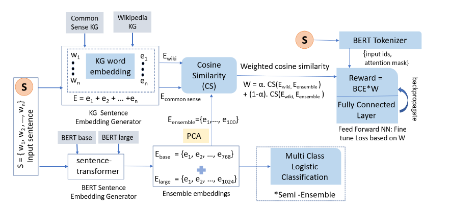

# Simple is Better and Large is Not Enough:Towards Ensembling of Foundational Language Models
This repository contains our code and dataset for the paper "Simple is Better and Large is Not Enough:
Towards Ensembling of Foundational Language Models" submitted to ACL 2023. The datasets used in this code are publicly available, however, we will also provide a processed version (e.g. after removing slangs).

# Downloading the Code
The codes and implementation are provided in the notebooks in this repository

## User agreement
This code can only be used for research purposes. 

# Datasets
 We use two standard benchmarks and two real-world datasets to evaluate the performance of proposed methods.
 

## GoEmotions
[GoEmotions](https://huggingface.co/datasets/go_emotions)
dataset contains 58k carefully curated Reddit comments labeled for 27 emotion categories and neutral for the sentiment classification task.

## PRITMATE
[PRIMATE 2022 dataset](https://github.com/primate-mh/Primate2022)
 PRIMATE is a real-world dataset on mental health with posts coming from Reddit’s subreddit r/depression_help. PRIMATE stands for PRocess knowledge Integrated Mental heAlth daTasEt.  aims to train conversational agents to identify parts of the user’s content that can answer a certain number of questions in clinical questionnaires like the Patient Health Questionnaire (PHQ-9). The dataset consists of ∼ 2500 posts annotated with nine “yes” or “no” labels corresponding to whether or not the post answers the nine PHQ-9 questions.

## SNLI
[SNLI](https://huggingface.co/datasets/snli)
corpus is the standard dataset for Natural Language Inferencing application, a collection of 570K labeled human-written English sentence pairs.

## Twitter 
[Twitter](https://github.com/thepanacealab/covid19_twitter)
dataset is tasked to train machine learning and deep learning models for sentiment detection on 1.6 Million tweets collected during COVID-19 Pandemic. Each row in the dataset is marked as 1 for positive and 0 for negative.

# Sample predictions done by different BERT models on GoEmotions

| Text Sentence                                          | Expected   | $BERT_{tiny}$            | $BERT_{Mini}$            | $BERT_{Base}$            | $BERT_{Large}$           |
|-----------------------------------------------------------------------------|------------|--------------------------|--------------------------|--------------------------|--------------------------|
| Give a listen to Gramatik, he is amazing.                              | Admiration | :x: | :x: | :x: | :x: |
| Wish more people shared your thoughts,   | Caring | :heavy_check_mark:  | :x:  | :x:  | :x:  | |
| I'm in you too.                                           | Sadness    | :x:  | :heavy_check_mark:  | :x:  | :x:  |
|FYI: Time in Europe works the same as the State. |  Annoyance  | :x:  | :x:  | :heavy_check_mark:  | :x:  |
| I feel sorry for this little girl. She's legitimely scared.            | Remorse    | :x:  | :x:  | :x:  | :heavy_check_mark: |

# Illustration of the Deep-Ensemble Architecture

We train Deep-Ensemble using a policy gradient that relies on
knowledge graphs(KG)

